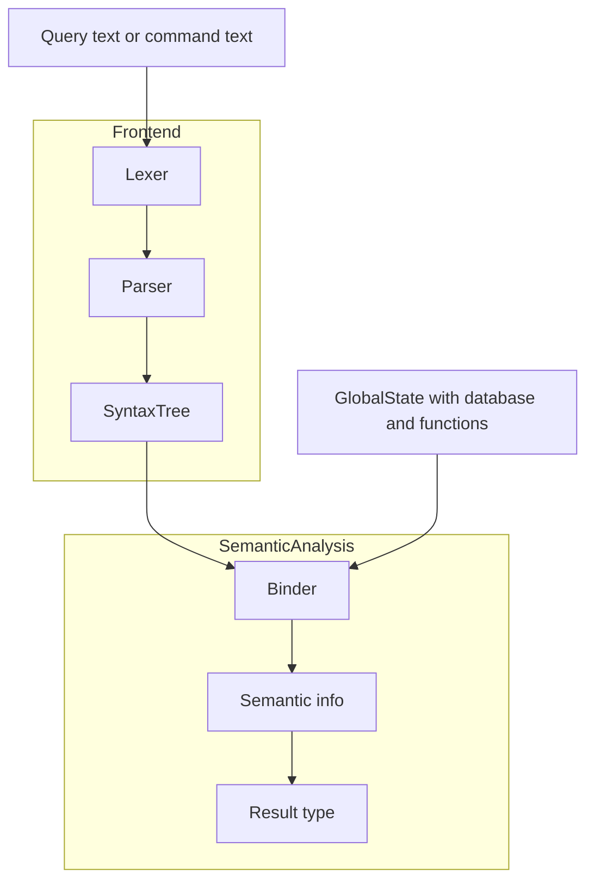

## Repos:
1. [KQL](https://github.com/microsoft/Kusto-Query-Language)
1. [Extensions and tools](https://github.com/mattwar/Kusto.Toolkit)

## Quick background on compiler phases


**Legend / phases:**

1. Lexing: Lexer turns raw query text into tokens.

1. Parsing: QueryParser / CommandGrammar builds a SyntaxTree (AST).

1. Semantic analysis (binding):
    * Binder walks the syntax tree using   GlobalState. 
    * Resolves symbols (tables, columns,   functions).
    * Computes ResultType and other type info (using TypeFacts, conversions, promotions, etc.).

1. Public API:
    * KustoCode.Parse = lex + parse (no semantics).
    * KustoCode.ParseAndAnalyze / Analyze = lex + parse + semantic bind.

## Namespaces with public APIs
```csharp
using Kusto.Language;
using Kusto.Language.Symbols; // Semantic APIs
using Kusto.Language.Syntax; // Syntax APIs
```
💡 Hint: if you are code reading and looking for some public API, restrict your search to files with these namespaces. Rest are internal.

## APIs:
[High level ReadMe for KQL syntax and semantic APIs](https://github.com/microsoft/Kusto-Query-Language/blob/master/src/Kusto.Language/readme.md)

I cover more depth below.
### Parsing:
The compiler performs Syntax analysis on the input query string and transforms a valid query into a Syntax tree. Syntax tree is made of syntax nodes. This phase checks for structural correctness and not for semantic correctness. That is, a query could be structurally correct but may not have any meaning and can still pass this phase of compilation.

```csharp
// parse only
var query = "T | project a = a + b | where a > 10.0";
var code = KustoCode.Parse(query);

// check parse errors
var diagnostics = code.GetDiagnostics();
```

### Semantic analysis/Binding:
The meaning of the query is verified during Semantic analysis and at the end of this phase, either every node has a semantic info attached to it, or has diagnostics on why it failed semantic checks.

When variables, columns (syntax nodes in general) are bound to their definitions, we get `symbols`. Symbols contain semantic information about the syntax node. This is produced when the compiler performs semantic analysis.

[sourcecode: Symbol](https://github.com/microsoft/Kusto-Query-Language/blob/master/src/Kusto.Language/Symbols/Symbol.cs)

[sourcecode: Symbol Kinds](https://github.com/microsoft/Kusto-Query-Language/blob/master/src/Kusto.Language/Symbols/SymbolKind.cs)

#### How to use the API
```csharp
var globals = GlobalState.Default.WithDatabase(
    new DatabaseSymbol("db",
        new TableSymbol("T", "(a: real, b: real)")));

var query = "T | project a = a + b | where a > 10.0";
var code = KustoCode.ParseAndAnalyze(query, globals);
```

Now when you navigate the syntax tree you can access the `ReferencedSymbol` and `ResultType` properties that tell you what is being referenced and the type of any expression.

[sourcecode: Public API for `ReferencedSymbol`](https://github.com/microsoft/Kusto-Query-Language/blob/master/src/Kusto.Language/Syntax/SyntaxNode_Semantics.cs#L19)

Similar to Syntax errors, there could be semantic errors in the query. i.e, operations which do not have a valid meaning and no automatic type promotions exist.
Get the `Root` of the `SyntaxTree` and look for `SemanticDiagnostics`.

[sourcecode: Check for Semantic Errors](https://github.com/microsoft/Kusto-Query-Language/blob/343d194a104ee92d11ddfa90e4bce2be86a65d71/src/Kusto.Language/Syntax/SyntaxNode_Semantics.cs#L76)

### Types
**Scalar** : a scalar is a single value (or a single-typed value), not a collection of rows or columns.

**Tabular** : a tabular type is a table-like shape (rows + columns).

#### Type Promotions
Type promotions are automatically performed during semantic analysis. So `ResultType` from a `Symbol` should give you the correct type after promotions etc.

[sourcecode: Various kinds of conversions](https://github.com/microsoft/Kusto-Query-Language/blob/master/src/Kusto.Language/Symbols/Conversion.cs)

[sourcecode: API to get common type among a set of types](https://github.com/microsoft/Kusto-Query-Language/blob/343d194a104ee92d11ddfa90e4bce2be86a65d71/src/Kusto.Language/Symbols/TypeFacts.cs#L67)

### Other Useful APIs not covered above:
[sourcecode: Type Facts](https://github.com/microsoft/Kusto-Query-Language/blob/master/src/Kusto.Language/Symbols/TypeFacts.cs)

[sourcecode: Scalars](https://github.com/microsoft/Kusto-Query-Language/blob/master/src/Kusto.Language/Symbols/ScalarSymbol.cs)

### CodeGen
You can completely ignore codegen for the purposes of trace store as we implement `where`, `project` ourselves and delegate the rest to `DataFusion`. Including this subsection only for completeness.

## Further help
Invoke Github copilot, reference the repo listed at the top and ask questions.
